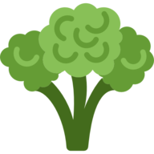

# Healthy Living



Healthy Living is a Dapp based on Blockstack that enables users to keep track of their food intake and sport activities every day. It is a user-friendly and delightful Dapp that gives you 100% control over your own private data.

The app is live and you can start using it today at https://healthy-living.technology-valley.com/.

## Benefits
### You own your data
This app is 100% private by default. You have full control over your data because everything is stored on the blockchain. There is no evil corporation behind that can use your personal data for profit.

### Completely secure
Our app offers the highest level of security as it relies on world-class end-to-end encryption technology. All data communication and files stored on the blockchain are fully encrypted.

### Innovative and user-friendly
This app offers innovative and user-friendly user interface that everyone can use. It does not need any installation and it works equally well on desktop and mobile devices.

## Project setup
```
npm install
```

### Compiles and hot-reloads for development
```
npm run serve
```

### Compiles and minifies for production
```
npm run build
```
